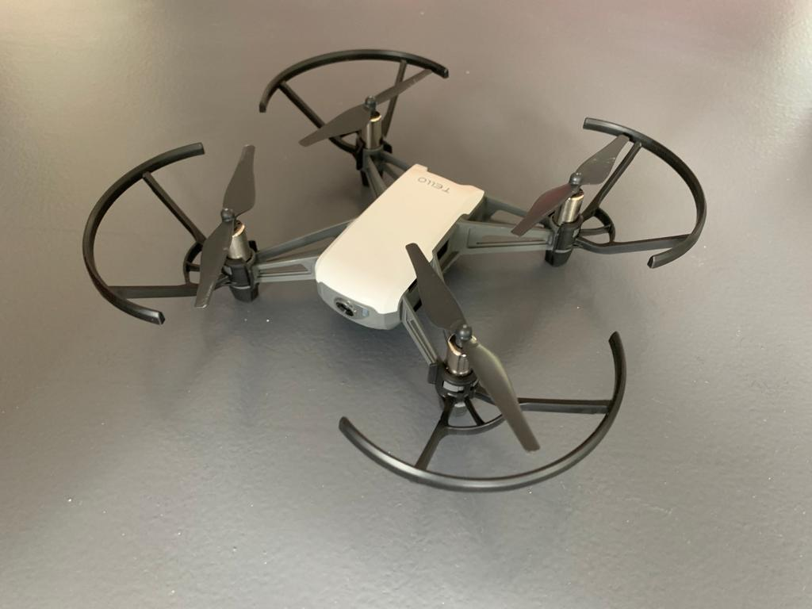

# Tello-Drone-Project
Repository for small projects/ scripts for DJI ryze tello drone:

## Joystick Functions
Currently the Main.py script will try and connect to a Joystick (XBox 360), main loop catches input events and acts according to the buttons:

* A = Takeoff
* B = Land
* Y = Activate Tracking Mode
* X = De-Activate Tracking Mode

1. Move Right Left, go up or down.
2. Do a flip in the pressed direction (only above 60% battery life)
3. Yaw and move forward/backward
4. Take a picture and save to ~/Pictures/Picture<#>

Rest of the buttons do not have functionality (so far)

## Tracking Mode
The tracking mode tries to follow the biggest found face and keep it in the middle of the frame. It will also try to keep a certain distance from the face using the bounding box area:

## TODO:

- [ ] Tracking gains (PD) need to be tuned a bit better since if you move to fast the drone will 'lose' you. 
- [ ] Need to implement moving left and right for short distances (only does yaw now)
- [ ] Create button to either turn on or off saving the tracked faces (quickly becomes a huge amount of pictures)
